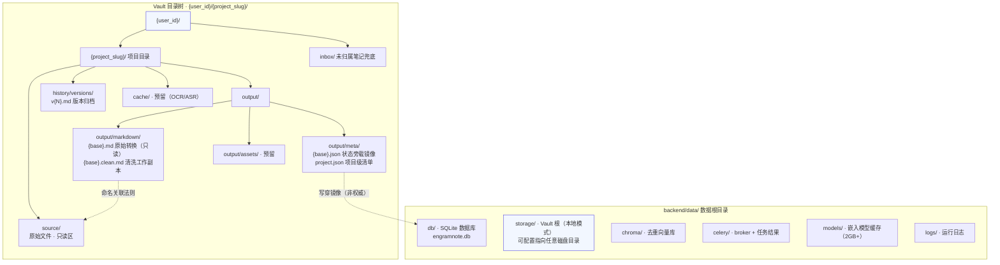
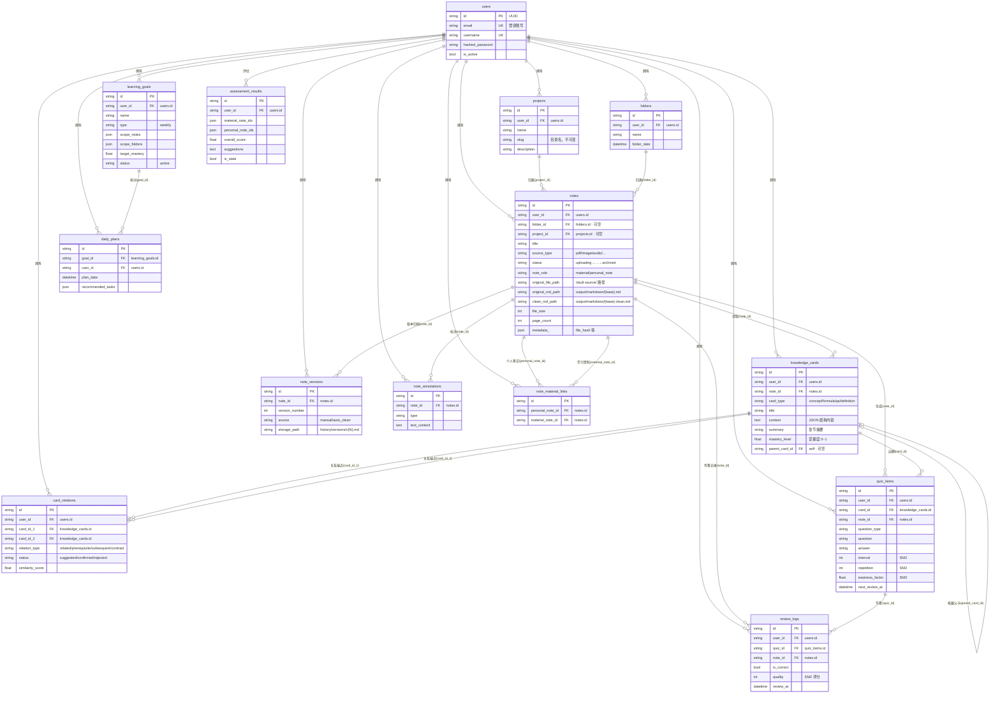

# 存储结构与数据库设计

> 本文件使用 Mermaid 绘制，可在支持 Mermaid 的编辑器（VS Code / Typora / GitHub / 语雀）中直接渲染。
>
> 相关代码：
> - 存储路径约定：[backend/app/services/vault_path.py](backend/app/services/vault_path.py)
> - 存储抽象层：[backend/app/services/storage_service.py](backend/app/services/storage_service.py)
> - 数据模型：[backend/app/models/](backend/app/models/)

---

## 一、文件树结构

项目所有持久化文件统一落在 `backend/data/` 下（可通过配置重定向）；其中 **Vault 根** 采用「项目隔离 + 状态旁载」结构，本地文件系统与 MinIO 对象存储共用同一 object-name 约定。

**命名关联法则**：`source/{base}{ext}` ↔ `output/markdown/{base}.md`（仅扩展名不同），保证脱离数据库也能通过文件名完成溯源。

---

## 二、数据库结构（ER 图）

核心表为 `notes`（笔记生命周期）与 `knowledge_cards`（知识卡片）；文件内容不存库，仅存对象路径引用。

---

## 三、设计要点速记

| 关注点 | 说明 |
|---|---|
| 状态权威源 | `notes.status` 是唯一权威，前端轮询 DB；`output/meta/*.json` 仅为物理旁载镜像 |
| 文件↔DB 关联 | 通过 `notes` 表的 `original_file_path / original_md_path / clean_md_path` 三个对象路径引用 |
| 用户隔离 | 所有路径以 `{user_id}` 为第一段，数据库查询也强制带 `user_id` 条件 |
| 知识卡片溯源 | `knowledge_cards.note_id` 可回溯到来源笔记；`card_relations` 无向对去重（`card_id_1 < card_id_2` 排序存储） |
| 复习调度 | SM2 算法参数（interval/repetition/easiness_factor）内嵌于 `quiz_items`，作答历史在 `review_logs` |
