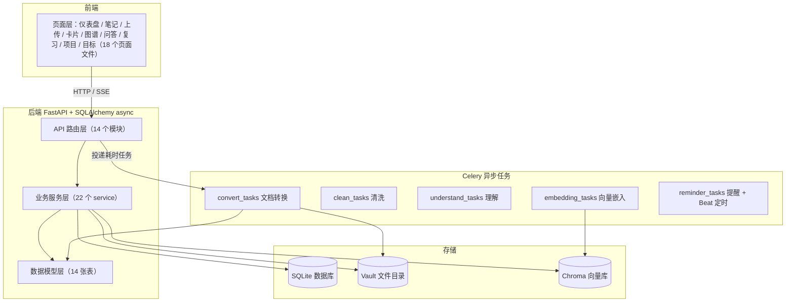
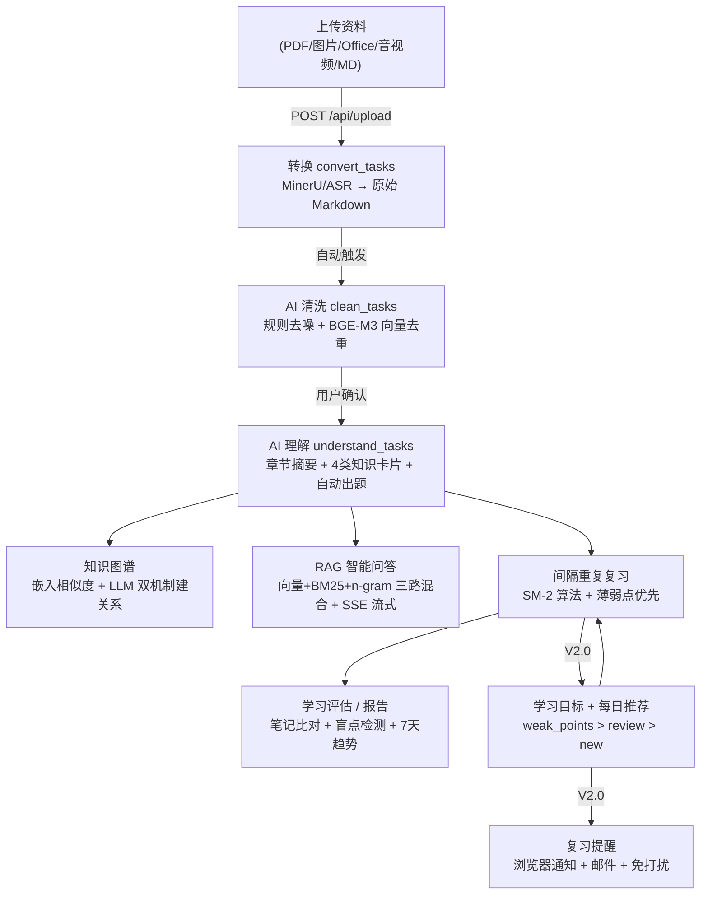
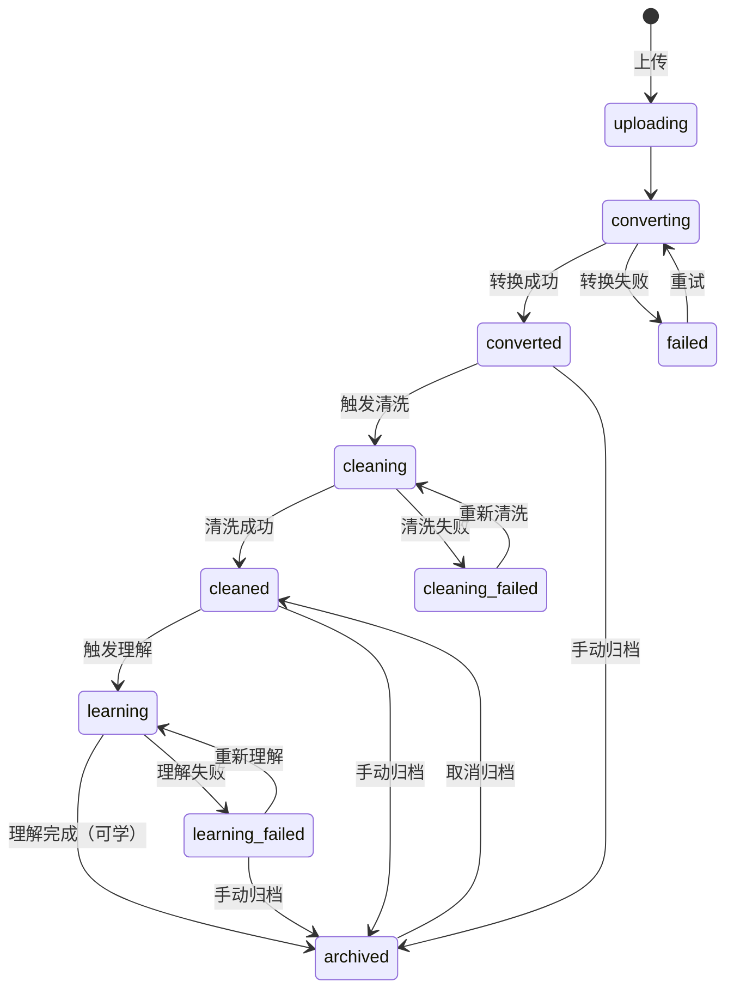
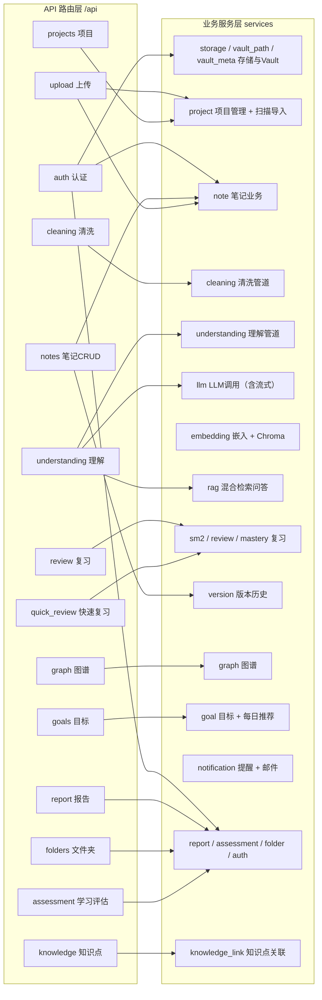
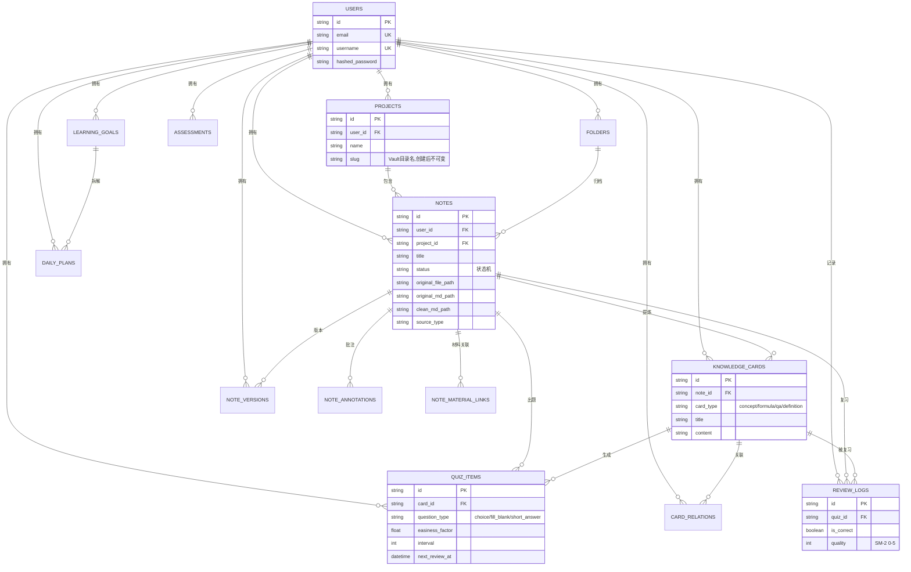
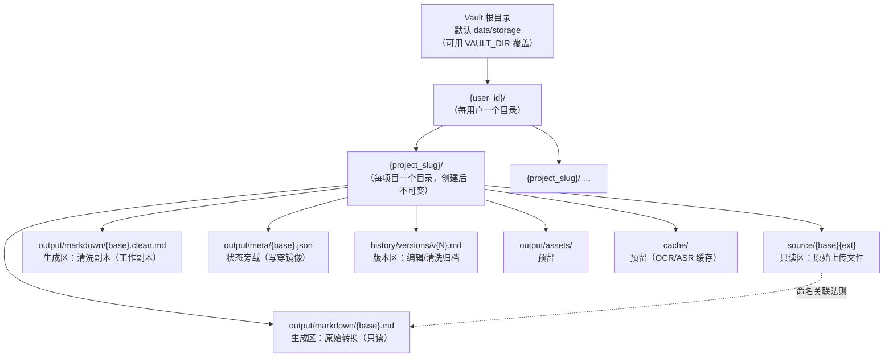
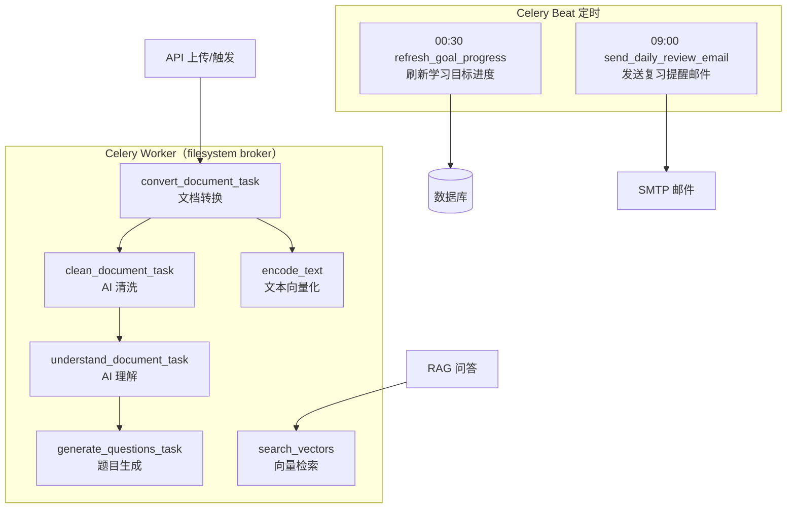
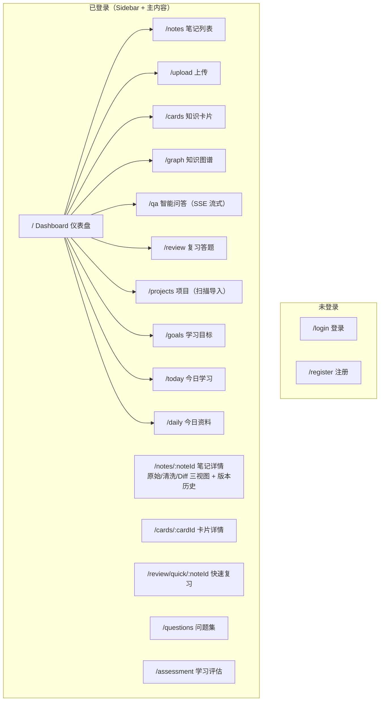
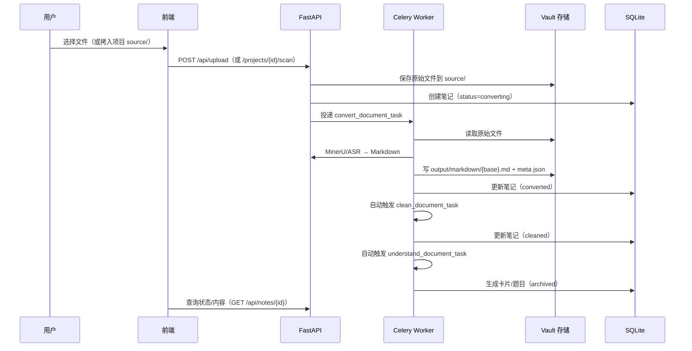
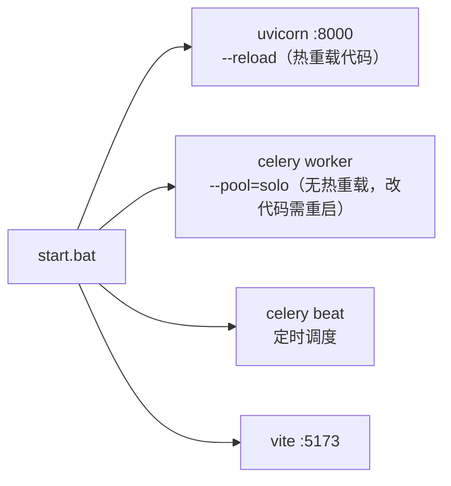

# EngramNote 项目图解

> 以图为主的项目全貌梳理，帮助你快速建立整体认知。所有图均为 Mermaid 语法，可在 VS Code（安装 Mermaid 插件）、Typora 或 GitHub 中直接渲染。

---

## 1. 一句话理解

**EngramNote 是一个「AI 驱动的学习笔记管理与知识库工具」**：把原始资料（PDF/图片/音视频/Office/Markdown）通过「转换 → 清洗 → 理解 → 复习」流水线变成个人的结构化知识库，并用 SM-2 间隔重复帮你记住它。

```
输入资料 ──▶ 转换(MinerU/ASR) ──▶ AI清洗 ──▶ AI理解(摘要/卡片/题目) ──▶ 间隔复习(SM-2)
              PDF→Markdown          去噪去重        知识图谱 / RAG问答        薄弱点优先
```

---

## 2. 系统总体架构



### 技术栈速览

| 层次 | 技术 | 说明 |
|------|------|------|
| 后端 | FastAPI + SQL Alchemy 2.0 (async) + SQLite | 零外部数据库依赖 |
| 任务队列 | Celery + 文件系统 broker | 无需 Redis，`task_acks_late=True` |
| 文档解析 | MinerU（云端 API / 本地 Pipeline 可选） | PDF → Markdown，保留公式表格 |
| AI 模型 | DeepSeek / GLM（OpenAI 兼容接口） | `httpx` 直调，无 LangChain |
| 嵌入模型 | BGE-M3 | ModelScope 下载，隔离到 Celery Worker 进程 |
| 向量库 | Chroma | 嵌入式，持久化 `data/chroma/` |
| 前端 | React 18 + TypeScript + Vite | 学术优雅视觉 |
| 图谱 | react-force-graph-2d | 力导向图 |

---

## 3. 核心学习闭环（端到端流程）



### 笔记状态机



注：archived 有两条达成路径——手动归档（converted/cleaned/learning_failed）与学习成功（learning）；取消归档统一回到 cleaned，知识卡片等学习产物保留。

---

## 4. 后端分层结构



---

## 5. 数据模型（14 张表）



> 数据库迁移：`_migrate_sqlite()` 启动时自动补列 + Alembic 版本脚本（001~005）。

---

## 6. Vault 目录结构（项目隔离 + 状态旁载）

这是最近一次重构的核心，也是理解「项目 → 文件」关系的关键。



### 关键约定

- **命名关联法则**：`source/{base}{ext}` ↔ `output/markdown/{base}.md` 仅扩展名不同 → 脱离数据库也能溯源
- **DB 是权威源**：状态先写数据库，再写穿镜像到 `output/meta/{base}.json`
- **创建项目时预建目录树**：`source / output/markdown / output/assets / output/meta / history/versions / cache`
- **手动放盘 + 扫描导入**：文件拷进 `source/` → 点「扫描导入」(`POST /projects/{id}/scan`) → 自动建笔记并触发转换，已导入文件自动跳过
- **路径兼容**：`_resolve_path` 同时兼容新 Vault 路径与历史遗留路径（如 `{user_id}/{folder_id}/original.md` 会自动补 bucket 前缀），保证旧笔记可读

---

## 7. Celery 任务与定时调度



---

## 8. 前端页面路由



---

## 9. 文件与数据流（一次完整上传会经历什么）



---

## 10. 常见"为什么"速查

| 问题 | 答案 |
|------|------|
| 笔记内容在哪？ | DB 存路径，内容在 `data/storage/{user}/{project}/output/markdown/` 下实时读取 |
| 为什么我上传后一直 converting？ | ① MinerU Token 过期（HTTP 401）② Worker 未运行 ③ Worker 代码过期未重启 |
| 为什么创建项目没看到文件夹？ | 新版创建项目时会**同步预建磁盘目录树**，刷新前端即可看到 |
| 怎么把已有文件加入项目？ | 手动拷到项目 `source/` 目录 → 前端点「扫描导入」 |
| 旧项目/旧笔记还读得到吗？ | 可以。`_resolve_path` 兼容历史路径（自动补 bucket 前缀），根目录回落 `data/storage` |
| 数据库在哪？ | `backend/data/db/engramnote.db`（删掉后重启自动重建） |
| 向量数据在哪？ | `backend/data/chroma/` |
| 定时任务跑在哪个进程？ | Celery Beat（与 Worker 一起由启动脚本拉起） |

---

## 11. 启动与进程关系



> ⚠️ **重要**：API 的 `--reload` 只热重载 FastAPI 进程；**Celery Worker 不会自动重载**。修改 `services/` 或 `config.py` 后，若转换/清洗/理解任务仍表现异常，请重启 Worker。

---

*本图由项目实际代码结构整理生成。若与代码有出入，以代码为准。*
