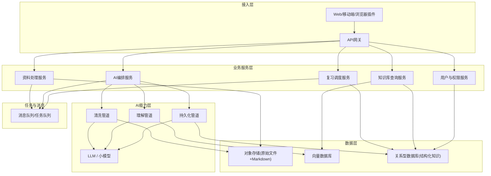
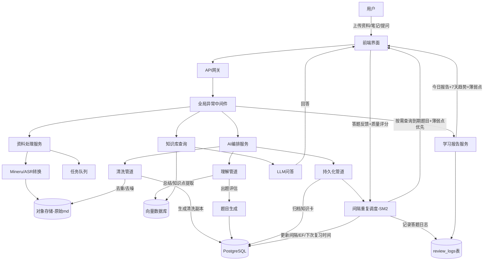

以下是根据第一个回答整理的项目架构要求文档，已导出为清晰的 Markdown 格式，方便 AI 或开发者直接理解本项目核心设计。

# AI 驱动的学习笔记管理与知识库工具 —— 项目架构要求

## 一、项目定位与核心设计原则

**定位**：以原始学习资料为起点，经过自动化清洗和理解，构建个人结构化知识库，并通过间隔重复与智能问答，形成"输入→内化→长期记忆"的学习闭环。

**关键原则**：
- **原始数据不可篡改**：所有资料一经导入，其原始转换结果（Markdown）永久只读保留。
- **处理链分层**：严格区分"清洗（去噪）""理解（提炼）""持久化（归档与复习）"三阶段，AI 不能越界加工原文。
- **人机协作**：AI 负责粗加工和提示，用户可随时审阅、修改、增删清洗后的副本及知识卡片。
- **渐进式智能**：随着数据积累，AI 对薄弱点的判断和题目推荐会越来越准。

## 二、总体架构设计（分层与模块）

### 架构图（Mermaid 描述）


### 文字版分层说明
1. **接入层**：前端界面（笔记管理、每日复习、问答、学习报告），通过 API 网关访问后端。
2. **业务服务层**（微服务或模块化单体）：
   - **资料处理服务**：接收上传，调用 Mineru / Qwen-ASR 转换为 Markdown。前置项目分别位于 mineru_plus 和 asr_plus
   - **AI编排服务**：核心大脑，按需触发清洗、理解、持久化流水线。
   - **复习调度服务**：基于遗忘曲线管理题库与推送。
   - **知识库查询服务**：提供检索、问答、笔记预览等读操作。
   - **知识图谱服务**：自动/手动建立知识卡片间关联关系（V1.2 新增）。
   - **文件夹管理服务**：当天学习资料按文件夹组织（V1.2 新增）。
   - **用户服务**：认证、配置。
3. **AI能力层**：每个管道调用合适的模型（LLM、嵌入模型等）完成特定任务。
4. **数据层**：
   - **对象存储**（本地文件系统 / MinIO/S3）：存放原始 PDF、视频、转换后的原始 Markdown。
   - **向量数据库**（Milvus/Chroma/pgvector）：存放文本块嵌入，用于相似去重、语义搜索和 RAG。
   - **关系型数据库**（SQLite 开发 / PostgreSQL 生产）：用户、笔记元数据、知识卡片、题库、学习记录、复习调度状态。
   - 可选**图数据库**（Neo4j）：表示知识间关联。
5. **任务队列**（Celery + 文件系统 broker / Redis）：处理视频转写、大文档解析等耗时任务。

## 三、核心模块详述（紧扣AI三个角色）

### 1. 资料摄入与转换模块（✅ 已实现）
- **输入**：教材PDF/图片、论文PDF、手写笔记照片、专利文本、规程文档、题库文件、课程视频/音频。
- **处理**：
  - 文档类 → Mineru / Marker / PDF-Extract-Kit，统一转为 Markdown（保留表格、公式 LaTeX）。
  - 音视频类 → Qwen-ASR / Whisper 转为带时间戳的文字稿，再分段整理为 Markdown。
- **存储**：原始文件存入对象存储（本地文件系统 `data/storage/original-files/`），生成的 Markdown 作为**原始笔记**存入数据库（只读），并打上来源、时间等元数据。

**已实现的 API 端点**：
- `POST /api/upload` — 上传文件，校验类型，存储原始文件，创建笔记记录，触发 Celery 异步转换；支持 `backend` 参数选择解析后端（pipeline/vlm-http-client）
- `GET /api/upload/{note_id}/status` — 查询文件转换状态
- `GET /api/notes` — 笔记列表（分页、搜索）
- `GET /api/notes/{id}` — 笔记详情（含 Markdown 内容实时读取）
- `PUT /api/notes/{id}` — 更新笔记（重命名）
- `DELETE /api/notes/{id}` — 删除笔记及关联文件
- `POST /api/auth/register` — 用户注册
- `POST /api/auth/login` — 用户登录
- `GET /api/auth/me` — 获取当前用户信息

**已实现的清洗 API 端点**：
- `POST /api/cleaning/{note_id}/start` — 手动触发清洗任务（converted/cleaned/cleaning_failed 状态可触发）
- `POST /api/cleaning/{note_id}/stop` — 停止正在进行的清洗任务（仅 cleaning 状态可停止，状态变为 cleaning_failed）
- `GET /api/cleaning/{note_id}/status` — 查询清洗状态
- `GET /api/cleaning/{note_id}/diff` — 获取原始版与清洗版的逐行对比（diff）
- `POST /api/cleaning/{note_id}/restore/{block_index}` — 恢复被注释的重复块
- `POST /api/cleaning/{note_id}/delete/{block_index}` — 彻底删除重复块

**已实现的理解管道 API 端点**：
- `POST /api/understanding/{note_id}/start` — 触发理解管道（cleaned/learning_failed 状态可触发）
- `GET /api/understanding/{note_id}/status` — 查询理解状态
- `GET /api/understanding/{note_id}/chapters` — 获取章节摘要列表
- `POST /api/understanding/{note_id}/generate-questions` — 触发题目生成（archived 状态可触发）
- `GET /api/understanding/{note_id}/questions` — 获取笔记关联的题目
- `GET /api/notes/{note_id}/cards` — 获取笔记关联的知识卡片
- `GET /api/cards` — 获取当前用户所有知识卡片（分页、按笔记筛选，返回含 `note_title` 字段，前端按笔记分组折叠展示）
- `GET /api/cards/{card_id}` — 获取知识卡片详情
- `PUT /api/understanding/cards/{card_id}` — 编辑知识卡片（标题/内容）
- `DELETE /api/understanding/cards/{card_id}` — 删除知识卡片（级联删除关联题目）
- `GET /api/understanding/{note_id}/duplicates` — 获取笔记的卡片去重建议（n-gram关键词匹配）
- `GET /api/questions` — 获取当前用户所有题目（分页、按笔记筛选，返回含 `note_title` 字段，前端按笔记分组折叠展示）
- `POST /api/understanding/ask` — RAG 智能问答（请求体：`{question: string, note_id?: string}`）

**已实现的笔记管理端点**：
- `POST /api/notes/{note_id}/archive` — 手动归档/取消归档笔记（archived ↔ cleaned）
- `GET /api/notes/archive` — 获取已归档笔记列表

**已实现的复习调度 API 端点**：
- `GET /api/review/due` — 获取当前用户到期待复习的题目列表（`next_review_at <= now OR next_review_at IS NULL`，按到期时间升序排列，空值优先；**薄弱点优先排序**：错误次数越多的卡片关联题目排序越靠前）
- `POST /api/review/submit` — 提交答题结果（请求体：`{quiz_id, user_answer, time_spent_ms}`），自动计算 SM-2 评分、更新调度参数、创建复习记录
- `GET /api/review/stats` — 获取复习统计（待复习数、今日完成数、今日正确率、总复习数、总正确率等）
- `GET /api/review/history` — 获取分页复习历史记录

**已实现的学习报告 API 端点**（第9周新增）：
- `GET /api/report/daily` — 获取今日学习报告（新掌握知识点数、复习总时长、今日正确率、各题型正确率、薄弱点数量）
- `GET /api/report/weekly-trend` — 获取最近7天复习趋势（每日复习数、正确数、正确率）
- `GET /api/report/weak-points` — 获取薄弱点列表（按错误次数降序排列的知识卡片，含卡片标题/类型/错误次数/正确率）

**已实现的知识图谱 API 端点**（V1.2 新增）：
- `GET /api/graph/relations` — 获取用户的知识图谱关系列表
- `GET /api/graph/suggestions` — 获取自动建议的卡片关系（BGE-M3 嵌入 + numpy 向量化余弦相似度 + 阈值筛选）
- `POST /api/graph/relations` — 手动创建卡片关系
- `PUT /api/graph/relations/{relation_id}` — 更新关系（接受/拒绝建议）
- `DELETE /api/graph/relations/{relation_id}` — 删除关系
- `GET /api/graph/stats` — 获取图谱统计信息

**已实现的快速复习 API 端点**（V1.2 新增）：
- `GET /api/quick-review/{note_id}` — 获取指定笔记的待复习题目
- `POST /api/quick-review/{note_id}/submit` — 提交快速复习答案

**已实现的文件夹 API 端点**（V1.2 新增）：
- `GET /api/folders` — 获取用户文件夹列表
- `POST /api/folders` — 创建文件夹
- `GET /api/folders/{folder_id}` — 获取文件夹详情（含关联笔记）
- `POST /api/folders/{folder_id}/notes/{note_id}` — 将笔记归入文件夹

### 2. AI清洗管道（角色一：清洗）（✅ 已实现）
**目标**：生成一份干净、无冗余的笔记副本，**绝对不改变原意、不总结、不润色**。
- **规则化清洗**（✅ 已实现）：
  - 去除页眉页脚、页码、水印、多余空行。
  - 统一中英文标点。（OCR/ASR 错字修正尚未实现，留待后续迭代）
- **AI辅助去重**（✅ 已实现）：
  - 对整篇笔记分块（chunk_size=500, overlap=50），计算嵌入向量（BGE-M3），通过余弦相似度（阈值0.85）找出重复段落。
  - 标记重复块，用户可选择"保留一份"或"全部保留"，默认仅显示一份但建立链接。
- **增删查改管理**（✅ 已实现）：
  - 用户可对**清洗副本**进行手动恢复/删除重复块操作。
  - 重复块用 HTML 注释包裹，可随时恢复；版本历史和 diff 回溯尚未实现，留待后续迭代。
- **输出**：与原始笔记关联的**清洗后笔记（Working Copy）**，作为后续理解的输入。

### 3. AI理解管道（角色二：理解）（✅ 部分已实现）
这个管道在用户主动触发（如导入新资料、写完笔记）或每日定时运行。
- **章节切分与摘要**（✅ 已实现）：根据 Markdown 标题层级自动切分章节，使用 ConversationSession 在同一对话窗口内依次处理，摘要+知识点提取合并为1次API调用
- **知识点提取**（✅ 已实现）：在同一对话窗口内依次追问每个章节，LLM 可参考之前已提取的知识点避免重复
- **题目生成**（✅ 已实现）：使用 ConversationSession 在同一对话窗口内依次追问每个批次，LLM 可参考之前已生成的题目避免重复或雷同
- **智能问答**（⚠️ 部分实现）：RAG 问答已实现，但向量检索因段错误禁用，当前使用知识卡片中文 n-gram 匹配
- **总结归纳**：
  - 对清洗后笔记进行分块摘要（利用 LLM 生成每节要点），再汇总成整篇摘要。
  - 提取核心概念、定义、公式、算法步骤，形成结构化知识点。
- **笔记评估与反馈**：
  - 用户写的学习笔记，AI 会对比原始资料，指出"遗漏了关键概念XX""此处理解与原文有偏差""建议补充推导过程"等，并给出改进建议。
- **每日抽问 & 薄弱点分析**（✅ 已实现）：
  - 结合当日学习内容，生成3-5个理解性问题（由 LLM 根据知识点即时生成），在指定时间推送给用户。
  - 记录回答正确性、耗时，分析常错概念，标记为薄弱点。
  - 每日生成学习报告：当日新掌握概念数、薄弱点清单、重难点建议、学习时长统计等。
  - 薄弱点优先推送：到期题目中，错误次数越多的卡片关联题目排序越靠前。
  - 7天趋势：最近7天每日复习数、正确数、正确率统计。
- **智能问答**：
  - 基于 RAG（检索增强生成）架构：将用户问题向量化，从知识库召回相关文本块和知识点，由 LLM 整合给出正确、易懂的解答，并注明引用来源。

### 4. AI持久化管道（角色三：持久化与间隔重复）
**目标**：把理解成果固化到知识库，并建立长期记忆机制。
- **知识库归档**（✅ 已实现）：
  - 将 AI 提取的知识点（概念卡、公式卡、问答对）存入结构化知识库，关联原始笔记和资料。
  - 自动去重合并：若新提取的概念与已有概念相似度 > 阈值，提示用户合并或更新。
- **题库编制**（✅ 已实现）：
  - 基于知识点，利用 LLM 生成多种题型：填空、简答、判断、推导题，甚至选择题。
  - 题目均带有难度、关联知识点、来源。
  - 用户可审核、修改、删除题目，题库持续积累。
- **遗忘曲线调度**（✅ 已实现）：
  - 采用 SM-2 算法，对每道题目独立计算复习间隔。
  - 按需查询到期题目（`next_review_at <= now OR next_review_at IS NULL`），替代 Celery Beat 定时任务。
  - 用户作答后根据答题质量评分（0-5），算法更新下次复习时间和舒适度因子。
  - 不同题型使用不同的评分映射策略：选择题多格式匹配(5/1)、填空题三级(5/3/1，含长度比例检查防误判)、简答题 n-gram 关键词覆盖度映射(1-5)。选择题支持字母前缀匹配（answer="A" vs user="A. 选项文本"）、去前缀纯文本比较等多种格式。
  - 薄弱点相关的题目可适当提高出现频率，强化记忆。（✅ 已实现：到期题目按错误次数降序排列，错误越多越优先推送）
  - 每日复习限额 50 题：`DAILY_REVIEW_LIMIT = 50`，`get_due_quizzes` 按剩余配额扣减、`submit_answer` 提交前校验、`get_review_stats` 的 due_count 也受限额约束
  - 推送方式：Web 通知、邮件或移动端提醒（待实现）。

## 四、数据存储与模型设计重点

### 已实现的数据表（第1-2周）

**用户表 (users)**：
| 字段 | 类型 | 说明 |
|------|------|------|
| id | String (UUID) | 主键 |
| email | String(255) | 唯一，索引 |
| username | String(100) | 唯一，索引，仅允许英文字母和数字 |
| hashed_password | String(255) | bcrypt 哈希 |
| is_active | Boolean | 默认 True，软禁用 |
| created_at | DateTime | 自动创建 |
| updated_at | DateTime | 自动更新 |

**笔记表 (notes)**：
| 字段 | 类型 | 说明 |
|------|------|------|
| id | String (UUID) | 主键 |
| user_id | String | 外键 → users.id，索引 |
| title | String(500) | 笔记标题（默认取文件名） |
| source_type | Enum | pdf, image, docx, pptx, xlsx, audio, video |
| original_file_path | String(1000) | 存储中原始文件路径 |
| original_md_path | String(1000) | 存储中原始 Markdown 路径 |
| clean_md_path | String(1000) | 存储中清洗后 Markdown 路径（nullable） |
| status | Enum | 笔记状态机（见下方） |
| file_size | Integer | 文件大小（字节） |
| page_count | Integer | 页数（nullable） |
| error_message | Text | 错误信息（nullable） |
| metadata | JSON | 额外元数据（nullable），兼容 SQLite 和 PostgreSQL |
| created_at | DateTime | 自动创建 |
| updated_at | DateTime | 自动更新 |

**笔记状态机**：
```
uploading → converting → converted → cleaning → cleaned → learning → archived
                ↓                        ↓            ↓          ↓
              failed                   failed    cleaning_failed  learning_failed
```

`cleaning_failed` 是清洗阶段的专属失败状态，用户可以从该状态重新触发清洗。`failed` 是转换阶段的失败状态。`learning_failed` 是理解管道的失败状态，用户可以从该状态重新触发理解。

用户也可以手动通过 `POST /notes/{note_id}/archive` 在 `archived ↔ cleaned` 之间切换。

### 已实现的数据表（第5-6周新增）

- **知识卡片表 (knowledge_cards)**：id, user_id, note_id, card_type(concept/formula/qa/definition), title, content, summary, chapter_title, source_text, metadata_, created_at, updated_at
- **题库表 (quiz_items)**：id, user_id, card_id, note_id, question_type(choice/fill_blank/short_answer), difficulty(easy/medium/hard), question, answer, options(JSON字符串), explanation, metadata_, created_at, updated_at
- **学习记录表 (review_logs)**：id, user_id, quiz_id, note_id, user_answer, is_correct, quality(0-5), time_spent_ms, review_at, created_at, updated_at

### 已实现的数据表（第8周新增/修改）

- **复习记录表 (review_logs)**（第8周新建）：
  | 字段 | 类型 | 说明 |
  |------|------|------|
  | id | String (UUID) | 主键 |
  | user_id | String | 外键 → users.id，索引 |
  | quiz_id | String | 外键 → quiz_items.id，索引 |
  | note_id | String | 外键 → notes.id，索引 |
  | user_answer | Text | 用户提交的答案 |
  | is_correct | Boolean | 是否正确 |
  | quality | Integer | SM-2 质量评分（0-5） |
  | time_spent_ms | Integer | 答题耗时（毫秒） |
  | review_at | DateTime | 复习时间，**索引**（第10周新增，优化报告聚合查询） |

- **题库表 (quiz_items) SM-2 调度字段**（第8周新增）：
  | 字段 | 类型 | 默认值 | 说明 |
  |------|------|--------|------|
  | interval | Integer | 1 | 复习间隔（天） |
  | repetition | Integer | 0 | 连续正确次数 |
  | easiness_factor | Float | 2.5 | 舒适度因子（最小1.3） |
  | next_review_at | DateTime | nullable | 下次复习时间（null=尚未复习），**索引**（第10周新增，优化到期查询） |
  | last_reviewed_at | DateTime | nullable | 上次复习时间 |
  | review_count | Integer | 0 | 累计复习次数 |

### 已实现的向量存储（第3-4周）

- **Chroma 向量数据库**（`data/chroma/`）：
  - 集合名：`note_chunks`
  - 存储内容：笔记文本块的嵌入向量
  - 元数据：`note_id`（关联笔记）、`chunk_index`（块索引）
  - ID 格式：`{note_id}_chunk_{index}`
  - 用途：余弦相似度去重、后续语义搜索和 RAG

### 已实现的数据表（V1.2 新增）

- **卡片关系表 (card_relations)**（V1.2 新增）：
  | 字段 | 类型 | 说明 |
  |------|------|------|
  | id | String (UUID) | 主键 |
  | user_id | String | 外键 → users.id，索引 |
  | card_id_1 | String | 外键 → knowledge_cards.id |
  | card_id_2 | String | 外键 → knowledge_cards.id |
  | relation_type | Enum | related / prerequisite / contrast |
  | status | Enum | confirmed / rejected / suggested |
  | similarity_score | Float | 自动建议时的余弦相似度（nullable） |
  | created_at | DateTime | 自动创建 |

- **文件夹表 (folders)**（V1.2 新增）：
  | 字段 | 类型 | 说明 |
  |------|------|------|
  | id | String (UUID) | 主键 |
  | user_id | String | 外键 → users.id，索引 |
  | name | String(200) | 文件夹名称 |
  | created_at | DateTime | 自动创建 |

- **笔记表新增字段**（V1.2）：`folder_id`（VARCHAR, nullable, 外键 → folders.id）

### 数据库维护机制（V1.2 新增）

- **Schema 自动迁移**：`_migrate_sqlite()` 在应用启动时检查已有列，缺失则执行 `ALTER TABLE ADD COLUMN`
- **孤儿数据自动清理**：每次启动检查 7 类孤儿场景（review_logs/quiz_items/knowledge_cards/card_relations/notes.folder_id），按外键依赖顺序清理

这种设计能方便地实现"由卡片找原始笔记""由复习记录分析薄弱点""更新间隔"等功能。

## 五、技术栈选型（实际采用）

| 层次 | 实际方案 | 原始方案 | 变更原因 |
|------|----------|----------|----------|
| 文档解析 | mineru_plus (已集成) | Mineru / Docling / Marker | 已有成型项目，直接调用 |
| 语音转文字 | asr_plus (已集成) | Qwen-ASR / Faster-Whisper | 已有成型项目，直接调用 |
| AI模型 | DeepSeek v4 Pro API | Qwen2.5 / DeepSeek + Ollama | 开发阶段先用云端 API |
| AI编排框架 | **无（httpx 直调 OpenAI 兼容 API）** | LangChain / LlamaIndex | 遵循 Karpathy 风格，不使用 LangChain，保持最小依赖 |
| LLM调用模式 | **多轮对话（ConversationSession）** | 单次独立调用 | 知识卡片提取和题目生成各使用独立对话窗口，同一窗口内依次追问 |
| 嵌入模型 | **BAAI/bge-m3**（通过 ModelScope 下载 Xorbits/bge-m3） | BGE / GTE / text2vec | 多语言支持，国内可下载 |
| 向量数据库 | **Chroma**（嵌入式，持久化到 data/chroma/） | Chroma / Milvus / pgvector | 零部署，开发阶段首选 |
| 关系型数据库 | **SQLite**（开发）/ PostgreSQL（生产） | PostgreSQL | 零配置启动，后续可切换 |
| 任务队列 | Celery + **文件系统 broker** | Celery + Redis | 无需安装 Redis，后续可切换。⚠️ Windows 上文件系统 broker 存在消息路由问题，建议 Windows 用 Redis。result_expires=3600 自动清理结果 |
| 对象存储 | **本地文件系统** / MinIO | MinIO | 无需安装 MinIO，策略模式可切换。os.replace 原子移动替代 shutil.copy2 |
| 后端框架 | FastAPI (Python) | FastAPI | 不变。全局异常中间件 ErrorHandlerMiddleware 统一错误格式 |
| 文件上传 | **流式上传**（1MB 分块读写） | 全量读取 | 避免大文件一次性读入内存，边读边校验大小 |
| 前端 | React 18 + TypeScript + Vite | React / Vue3 | 不变 |
| 密码哈希 | **bcrypt**（直接调用） | passlib + bcrypt | passlib 与 bcrypt 5.x 不兼容 |
| JWT | python-jose | python-jose | 不变 |
| ORM | SQLAlchemy 2.0 (async) | SQLAlchemy | 不变 |
| Markdown 渲染 | marked.js + marked-highlight + highlight.js | 待定 | marked v14 移除内置 highlight，改用 marked-highlight 扩展 |
| 容器化 | Docker + Docker Compose + Nginx | Docker | 多阶段构建，国内源加速（Docker Hub镜像加速+pip清华源+npm淘宝源） |
| Docker 镜像加速 | `docker.1ms.run` + `docker.m.daocloud.io` | 无 | Docker Desktop → Settings → Docker Engine 配置 registry-mirrors |
| Dockerfile 系统依赖 | `libgl1` | `libgl1-mesa-glx` | Debian trixie 中已废弃 libgl1-mesa-glx，必须用 libgl1 替代 |
| Docker 数据迁移 | 符号链接到 D 盘 | 默认 C 盘 | C 盘空间不足时，将 WSL 数据目录迁移到其他盘 |

## 六、已实现的项目结构

```
EngramNote/
├── backend/
│   ├── .env                         # 环境变量（DeepSeek/Mineru API Key）
│   ├── requirements.txt             # Python 依赖
│   ├── alembic.ini                  # 数据库迁移配置
│   ├── alembic/                     # 迁移脚本
│   ├── data/                        # 运行时数据（自动创建）
│   │   ├── db/engramnote.db         # SQLite 数据库
│   │   ├── storage/                 # 文件存储
│   │   │   ├── original-files/      # 原始上传文件
│   │   │   └── markdown/            # 转换后的 Markdown（含原始版和清洗版）
│   │   ├── chroma/                  # Chroma 向量数据库（嵌入数据）
│   │   ├── models/                  # 嵌入模型缓存（BGE-M3）
│   │   └── celery/                  # Celery 队列数据
│   └── app/
│       ├── main.py                  # FastAPI 入口（lifespan 自动建表 + 日志初始化，V1.2增强）
│       ├── config.py                # 配置管理（零依赖默认值，含清洗/嵌入/日志配置项）
│       ├── database.py              # SQLAlchemy 异步连接（SQLite/PostgreSQL + _migrate_sqlite Schema迁移 + 孤儿数据清理，V1.2增强）
│       ├── core/                    # 核心模块（V1.2新增）
│       │   └── logging_config.py    # 统一日志配置（控制台+文件轮转，V1.2新增）
│       ├── models/                  # 数据模型
│       │   ├── base.py              # 基础模型（UUID 主键 + 时间戳）
│       │   ├── user.py              # 用户模型
│       │   ├── note.py              # 笔记模型（含状态机枚举：cleaning/cleaned，folder_id字段V1.2新增）
│       │   ├── knowledge_card.py    # 知识卡片模型（CardType枚举 + KnowledgeCard表）
│       │   ├── quiz_item.py         # 题库模型（QuestionType/DifficultyLevel枚举 + QuizItem表 + SM-2调度字段）
│       │   ├── review_log.py        # 复习记录模型（ReviewLog表，答题日志+质量评分）
│       │   ├── card_relation.py     # 卡片关系模型（RelationType/RelationStatus枚举 + CardRelation表，V1.2新增）
│       │   └── folder.py            # 文件夹模型（Folder表，V1.2新增）
│       ├── schemas/                 # Pydantic 请求/响应模型
│       │   ├── user.py              # 用户 Schema
│       │   ├── note.py              # 笔记 Schema
│       │   ├── knowledge.py         # 知识卡片和题目 Schema
│       │   ├── cleaning.py          # 清洗 Schema
│       │   ├── review.py            # 复习调度 Schema（DueQuiz/SubmitAnswer/ReviewStats/ReviewHistory）
│       │   ├── report.py            # 学习报告 Schema（DailyReport/WeeklyTrend/WeakPoints，第9周新增）
│       │   ├── graph.py             # 知识图谱 Schema（CardRelation/GraphStats，V1.2新增）
│       │   └── folder.py            # 文件夹 Schema（FolderCreate/FolderDetail，V1.2新增）
│       ├── api/                     # API 路由
│       │   ├── router.py            # 总路由注册（含清洗+复习+报告路由）
│       │   ├── auth.py              # 认证 API + get_current_user 依赖
│       │   ├── notes.py             # 笔记 CRUD API
│       │   ├── upload.py            # 文件上传 API（流式上传，第10周优化）
│       │   ├── cleaning.py          # 清洗 API（触发/状态/diff/恢复/删除，直接操作Note对象无需重复查询）
│       │   ├── understanding.py     # AI 理解管道 API（触发理解/状态/章节/卡片/问答/题目，批量删除旧数据，顶部统一导入）（10个端点）
│       │   ├── review.py            # 复习调度 API（due/submit/stats/history）
│       │   ├── report.py            # 学习报告 API（daily/weekly-trend/weak-points，第9周新增）
│       │   ├── graph.py             # 知识图谱 API（relations/suggestions/stats，V1.2新增）
│       │   ├── quick_review.py      # 快速复习 API（按笔记获取题目+提交答案，V1.2新增）
│       │   └── folders.py           # 文件夹 API（CRUD+笔记归入文件夹，V1.2新增）
│       ├── middleware/              # 中间件（第10周新增）
│       │   ├── __init__.py          # 中间件包初始化
│       │   └── error_handler.py     # 全局异常处理中间件（统一错误格式 {detail, error_code}）
│       ├── services/                # 业务逻辑
│       │   ├── auth_service.py      # JWT 认证（bcrypt + python-jose）
│       │   ├── note_service.py      # 笔记业务（分页/搜索/Markdown 读取/清洗版读取/级联删除，V1.2增强）
│       │   ├── storage_service.py   # 存储服务（本地/MinIO 策略模式，os.replace原子移动，第10周优化）
│       │   ├── cleaning_service.py  # 清洗服务（规则清洗/分块/副本生成/恢复/删除）
│       │   ├── embedding_service.py # 嵌入服务（BGE-M3 + Chroma 向量存储，模块级单例缓存 + HF_HUB_OFFLINE + 本地缓存预检查，V1.2优化）
│       │   ├── llm_service.py       # LLM API 调用服务（httpx直调，debug模式GLM/DeepSeek切换，ConversationSession多轮对话，批量题目生成，RateLimiter令牌桶限流while循环，重试抖动+上限，Semaphore并发控制）
│       │   ├── understanding_service.py # 理解管道服务（章节切分、摘要、知识点提取、卡片去重检测(n-gram)）
│       │   ├── rag_service.py       # RAG 问答服务（向量检索已禁用，使用知识卡片中文n-gram匹配）
│       │   ├── sm2_service.py       # SM-2 间隔重复算法（calculate_sm2核心算法 + quality_from_answer多格式评分映射 + _score_short_answer简答题n-gram评分 + 填空题长度比例检查防误判）
│       │   ├── review_service.py    # 复习调度服务（get_due_quizzes薄弱点优先排序 + submit_answer答题流程+日志 + get_review_stats统计（子查询LIMIT优化） + get_review_history历史）
│       │   ├── report_service.py    # 学习报告服务（get_daily_report条件聚合3条SQL + get_weekly_trend按日期分组1条SQL + get_weak_points薄弱点分析，第9周新增）
│       │   ├── graph_service.py     # 知识图谱服务（auto_suggest_relations自动建议+numpy向量化相似度+run_in_executor，V1.2新增）
│       │   └── folder_service.py    # 文件夹服务（CRUD+笔记归入文件夹+返回序列化dict，V1.2新增）
│       └── tasks/                   # 异步任务
│           ├── celery_app.py        # Celery 配置（include: convert_tasks + clean_tasks + understand_tasks，result_expires=3600结果自动清理，第10周新增）
│           ├── convert_tasks.py     # 文档转换任务（mineru_plus + asr_plus，转换后自动触发清洗）
│           ├── clean_tasks.py       # 清洗任务（规则清洗→分块→嵌入→去重→生成副本）
│           └── understand_tasks.py  # 理解管道任务（章节切分→摘要→知识点提取→题目生成）
├── frontend/
│   ├── package.json                 # React 18 + TypeScript + Vite
│   ├── .nvmrc                       # Node.js 18+ 要求
│   ├── index.html
│   ├── vite.config.ts               # Vite 配置（含 API 代理）
│   ├── tsconfig.json
│   └── src/
│       ├── main.tsx                 # 入口
│       ├── App.tsx                  # AuthProvider 包裹 + 路由（含 /today 路由）
│       ├── contexts/
│       │   └── AuthContext.tsx      # 认证上下文（AuthProvider + useAuth hook，第11周新增）
│       ├── api/
│       │   └── client.ts            # API 请求封装（fetch + JWT Token + 清洗 API + 复习调度 API + 学习报告 API + 422错误数组处理）
│       ├── components/
│       │   ├── Navbar.tsx           # 顶部导航栏（含"知识库"、"问题集"、"问答"、"今日学习"导航，使用 useAuth）
│       │   ├── CleaningPanel.tsx    # 清洗操作面板（触发/进度/重复块管理）
│       │   ├── DiffView.tsx         # 行级 diff 对比视图（颜色编码）
│       │   ├── LoadingSpinner.tsx   # 统一加载中组件（旋转动画+文字，第11周新增）
│       │   ├── EmptyState.tsx       # 统一空数据状态组件（图标+提示+操作按钮，第11周新增）
│       │   └── ErrorDisplay.tsx     # 统一错误展示组件（错误信息+重试按钮，第11周新增）
│       ├── utils/
│       │   └── labels.ts           # 统一标签映射（statusLabels/cardTypeLabels/questionTypeLabels/difficultyLabels等，第11周新增）
│       ├── pages/
│       │   ├── Login.tsx            # 登录页（使用 useAuth）
│       │   ├── Register.tsx         # 注册页（使用 useAuth）
│       │   ├── Dashboard.tsx        # 仪表盘（最近笔记 + 快捷上传 + 今日待复习卡片 + 今日学习报告 + 薄弱点列表 + 7天趋势柱状图 + 新用户引导，第11周增强）
│       │   ├── NotesList.tsx        # 笔记列表（分页/搜索/删除/归档筛选，统一状态组件）
│       │   ├── NoteDetail.tsx       # 笔记详情（三视图：原始版/清洗版/对比视图，统一状态组件；归档/取消归档后调用 fetchNote 刷新完整数据）
│       │   ├── Upload.tsx           # 上传页（拖拽 + 轮询状态 + 解析方式选择）
│       │   ├── KnowledgeCards.tsx   # 知识卡片列表页（统一状态组件+统一标签映射）
│       │   ├── CardDetail.tsx       # 知识卡片详情页（统一状态组件+统一标签映射）
│       │   ├── QA.tsx               # 智能问答页（统一空状态组件）
│       │   ├── Review.tsx           # 复习答题页（进度条/题型切换/即时反馈/SM-2信息/完成统计）
│       │   ├── QuestionSets.tsx     # 问题集列表页（按笔记分组/题型难度筛选/答案折叠，统一状态组件+统一标签映射）
│       │   ├── TodayLearn.tsx       # 今日学习页（报告摘要+待复习任务+薄弱点+答题流程，第11周新增）
│       │   ├── KnowledgeGraph.tsx   # 知识图谱页（力导向图可视化+建议关系面板，V1.2新增）
│       │   ├── QuickReview.tsx      # 快速复习页（上传后立即复习，V1.2新增）
│       │   └── DailyMaterials.tsx   # 今日资料页（文件夹列表+上传+状态轮询，V1.2新增）
│       └── styles/
│           └── global.css           # 艺术化设计系统（靛青渐变+暖金点缀+衬线标题+微动效+CSS变量+组件样式+diff视图样式）
├── backend/Dockerfile               # 后端 Docker 镜像（多阶段构建，清华pip源，libgl1替代libgl1-mesa-glx，第12周新增）
├── frontend/Dockerfile              # 前端 Docker 镜像（多阶段构建，淘宝npm源，第12周新增）
├── frontend/nginx.conf              # Nginx 配置（SPA回退+API反向代理+gzip，第12周新增）
├── docker-compose.yml               # Docker Compose（backend+frontend服务，生产模式含PG/Redis/MinIO，第12周更新）
├── .gitignore                       # Git 忽略规则（第12周新增）
├── start.bat                        # Windows 一键启动脚本（第12周新增）
├── start.sh                         # Linux/Mac 一键启动脚本（第12周新增）
└── README.md                        # 项目文档（功能+技术栈+快速开始+Docker+项目结构，第12周新增）
```

## 七、关键业务流程示例

**导入一本教材并开始学习：**
1. 上传 PDF → 资料处理服务调用 Mineru → 生成原始 Markdown 存入对象存储。 ✅ 已实现
2. 自动触发清洗管道 → 去重、去噪 → 生成清洗副本。 ✅ 已实现
3. 用户确认清洗结果后，点击"开始学习" → 理解管道运行：分章节总结、提取知识点、生成初始题目。 ✅ 已实现
4. 知识点和题目存入知识库和题库，按默认间隔初始化。 ✅ 已实现（SM-2 字段默认值：interval=1, repetition=0, easiness_factor=2.5, next_review_at=NULL）
5. 当天学习完成后，复习调度服务根据遗忘曲线推送到期题目；用户作答，系统记录并更新间隔。 ✅ 已实现（按需查询替代 Celery Beat）
6. 学习报告生成：展示了本章掌握的5个概念，薄弱点"贝叶斯公式推导"，建议明日复习。 ✅ 已实现（第9周：今日报告+7天趋势+薄弱点分析）

**每天复习提醒：**
- 用户访问复习页面时，系统按需查询 `next_review_at <= now OR next_review_at IS NULL` 的题目，按到期时间排序展示。 ✅ 已实现
- 用户答题后即时反馈正确答案与解析，SM-2 算法根据答题质量（0-5）更新下次复习时间和舒适度因子。 ✅ 已实现
- 不同题型使用不同评分映射：选择题精确匹配、填空题三级评分、简答题 n-gram 关键词覆盖度。 ✅ 已实现

## 八、架构完善与补充建议

1. **笔记版本与历史**：清洗副本的每次修改（包括AI去重操作、用户手动编辑）都应保存版本，支持 Diff 对比，避免误删重要内容。
2. **多源关联与知识图谱（可选）**：一篇论文和某教材第三章的观点可能相互印证，自动或半自动建立"引用""支撑""反驳"关系，会让知识库更有深度。
3. **渐进式出题与难度适配**：题库不要一次性生成太多，根据学习进度和正确率，动态生成新题。正确率高的知识点降低出题频率，薄弱点多出题。
4. **隐私与离线能力**：所有 AI 处理最好支持完全本地运行（Ollama+开源模型），避免资料外泄。前端可考虑做成桌面应用，数据完全在用户手中。
5. **学习计划与目标管理**：增加学习目标模块，用户设定"本周完成第三章并掌握所有公式"，系统可拆解任务、推荐每日学习量，并结合复习提醒。
6. **备份与同步**：如有多设备需求，可设计加密同步功能，或简单基于 Git 的版本控制同步纯文本 Markdown 库。

## 九、架构图简示（Mermaid代码）


